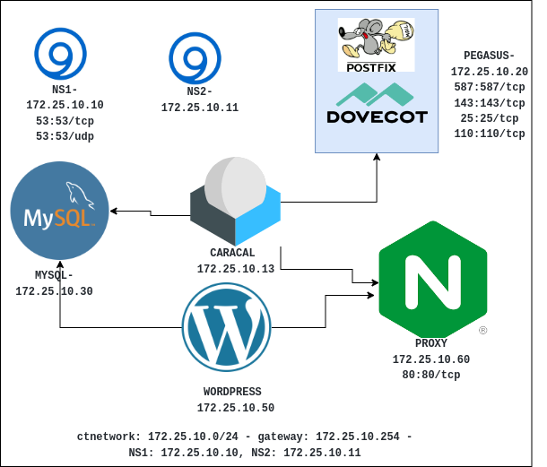

# mail-asa

Repositório destinado à atividade avaliativa da 2ª etapa da disciplina de Administração de Sistemas Abertos(ASA) do Curso Superior em Tecnologia em Redes de Computadores do IFRN - Campus Natal-Central. [Prof. Dr. Francisco de Lima Sales Filho](https://github.com/salesfilho)

### Estrutura do Projeto:
- [dns](./dns) : Dockerfile e arquivos de configuração do bind9 - Master       
- [dns2](./dns2): Dockerfile e arquivos de configuração do bind9 - Slave
- [MySQL](./MySQL): Dockerfile e scripts de banco de dados do MySQL.
- [webmail](./webmail): Dockerfile do Roundcube
- [mail](./mail): Dockerfile e arquivos de configuração do postfix e do Dovecot     
- [nginx](./nginx): Dockerfile e arquivos de configuração do proxy reverso nginx  
- [web](./web): Dockerfile do Wordpress




### Como subir a infra:
 1. Efetuar o clone do repositório;
  ```sh
     git clone https://github.com/luizfelipe1914/mail-asa.git
  ```
 2. Dentro de repositório criado, executar o script control_infra.sh [build | up | down | restart]:
   * build: constroi as imagens docker
   * up: sobe os containers
   * down: derruba os containers
   * restart: restarta a infraestrutura
  
```sh
    bash control_infra.sh [build | up | down | restart]
```


